# Building a Corsi-Rosenthal box / Comparetto Cube using materials available in Germany <!-- omit in toc -->

- [What is a Corsi-Rosenthal box / Comparetto Cube?](#what-is-a-corsi-rosenthal-box--comparetto-cube)
- [Bill of materials](#bill-of-materials)
  - [Box Fan](#box-fan)
  - [Air Filters](#air-filters)
  - [Other stuff](#other-stuff)
- [Building instructions](#building-instructions)
  - [Filter direction](#filter-direction)
  - [Filter Box](#filter-box)
  - [Fan and Fan Shroud](#fan-and-fan-shroud)
- [Noise](#noise)
- [Effectiveness](#effectiveness)

## What is a Corsi-Rosenthal box / Comparetto Cube?

It's a DYI Air cleaner that can be built rather inexpensively, and have been proven to significantly reduce airborne particles (such as SARS-CoV-2 carrying droplets and aerosols).

Read more about it, how to build it, etc... here:

https://encycla.com/Corsi-Rosenthal_Cube

https://cleanaircrew.org/boxfanfilterfaq/ 

## Bill of materials

Materials add up to about ~120 EUR per cube.

### Box Fan

The original building instructions are based on 20 inch box fans. There are not many 50 cm / 20 inch box fans on the market in Germany. I found the following one offered by Sichler Hausgeräte:

http://www.sichler-haushaltsgeraete.com/Extrastarker-Bodenventilator-3-Stufen-NX-6414-919.shtml 

(It is being sold by [Pearl](https://www.pearl.de/a-NX6414-3033.shtml) for about ~60 EUR)

Power consumption: 60 Watts
Air Flow: 50,26 m³/Min.

### Air Filters

Germany (and other european countries) use ISO 16890 to rate air filters compared to ASHRAE/MERV used in the US. Roughly comparable to MERV-13 is ISO16890 ePM1 which filter at >50% of particulate matter sized 0.3 - 1 micrometers. The previous (now obsolete) standard EN779:2012 equivalent is F7.

Z-Line filters are available from different sources (search for "Z-Line F7" or "Z-Line epm1"). 
I found the following for about 15 EUR/filter (sized 495mm x 495mm x 48mm, about 20 inch x 20 inch x 2 inch):

https://htm-shop.de/filterzelle-z-line-f7-iso-epm1/fz-02-1005-634

### Other stuff

Cardboard, adhesive tape.

## Building instructions

Check the [Construction Guide](https://encycla.com/Corsi-Rosenthal_Cube#construction-guide) for details.

### Filter direction

The filters are directional, three's a soft fuzzy outside and a structured inside. An arrow on the label indicates the air flow direction.

Filter Outside

Filter Inside

Direction Label
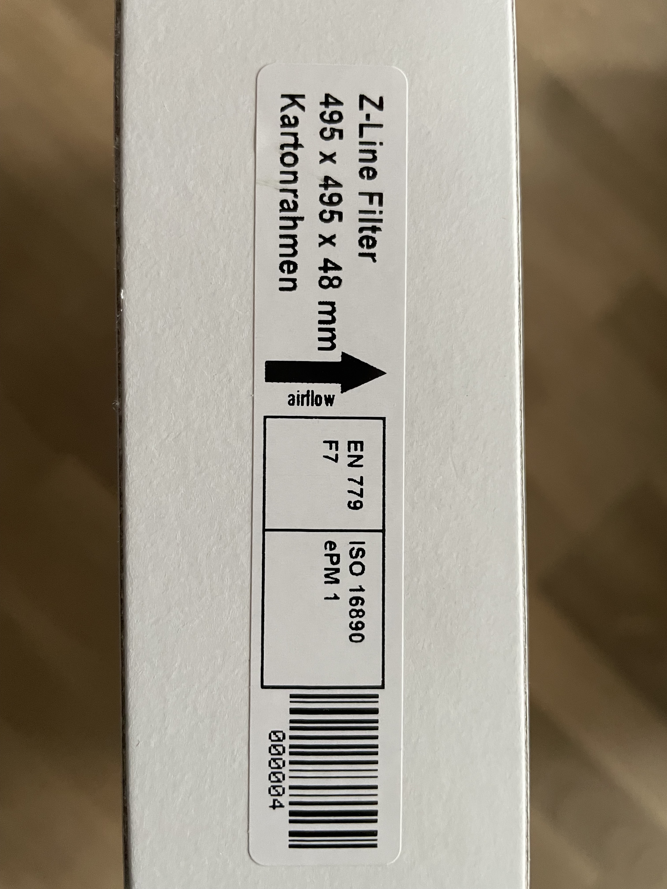

### Filter Box

Arrange all filters so that the airflow points inwards:
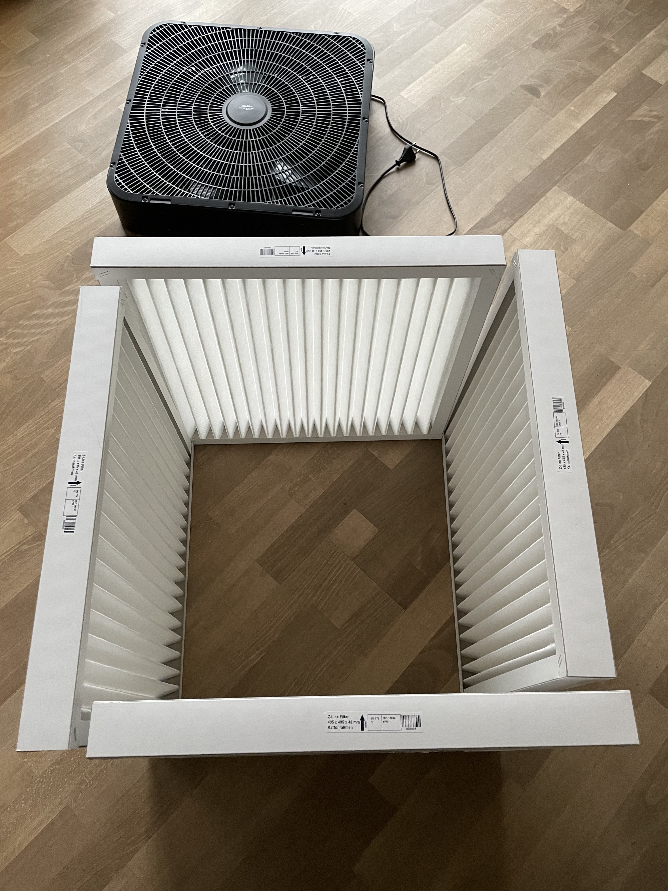

Fixate them with a bit of adhesive tape

Cut out cardboard for the bottom
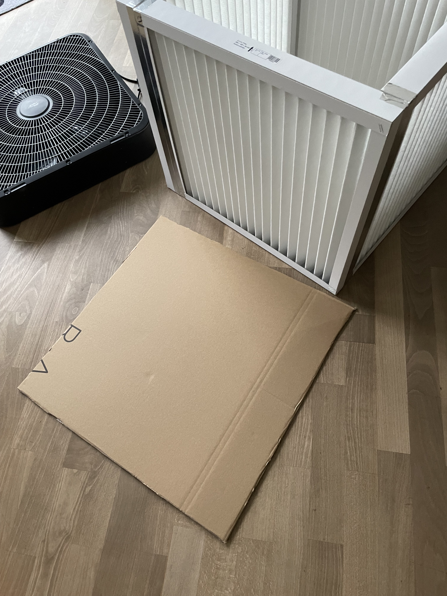

Use the adhesive tape to seal the sides and bottom  airtight
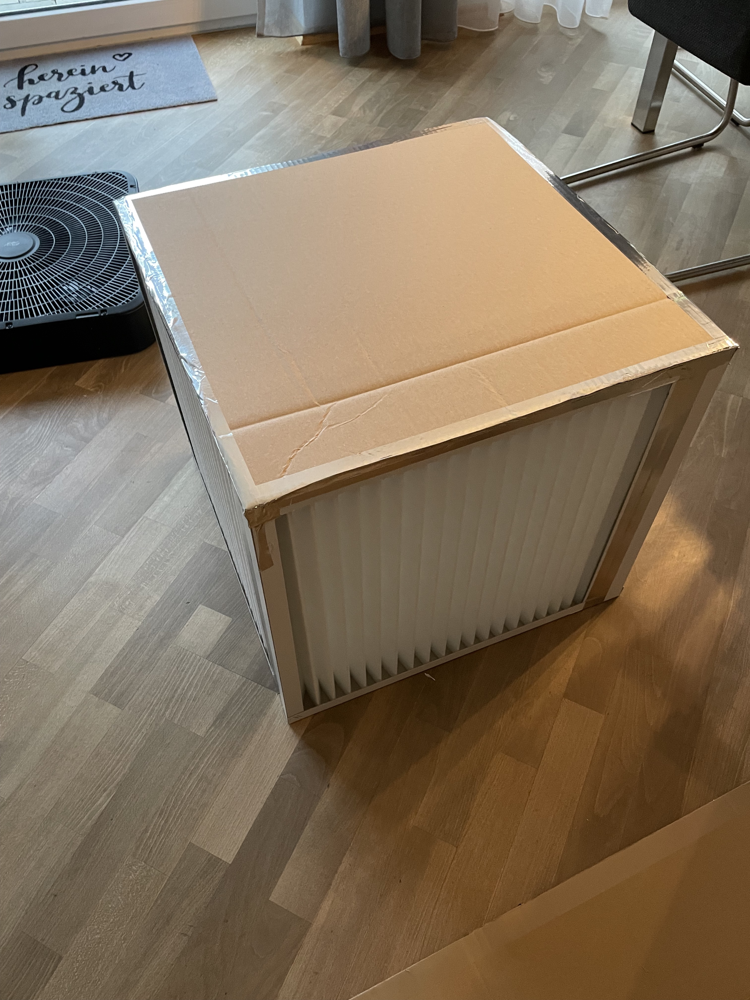

### Fan and Fan Shroud

Mount the fan on the box, blowing upward
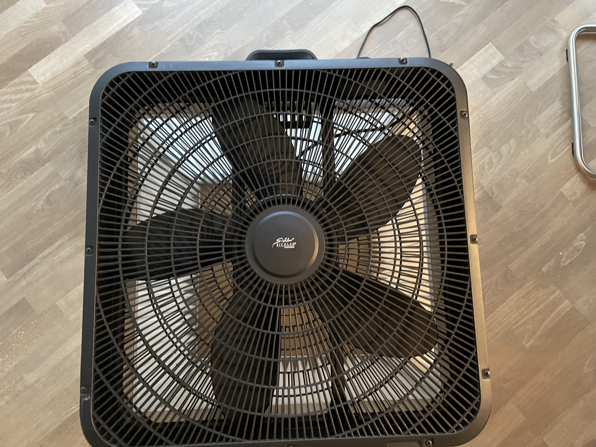

The space at the edge can be used to pass through the power cord
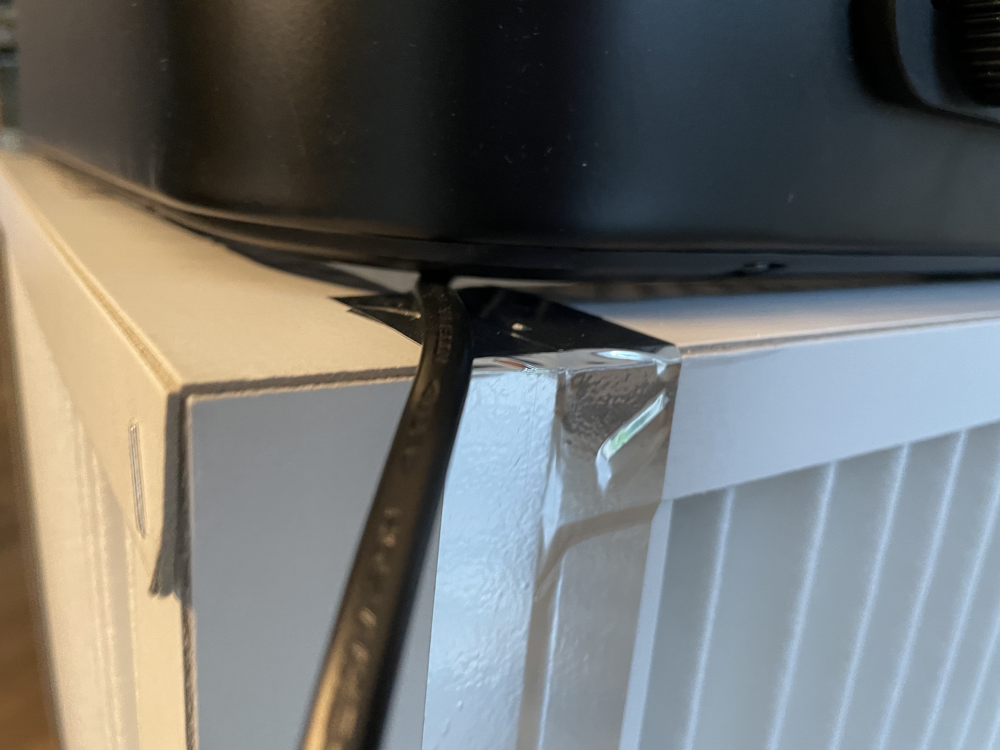

Mount the fan and seal it with adhesive tape.

The airflow only takes place in the middle (tested using tissue paper)- this calls for a fan shroud.
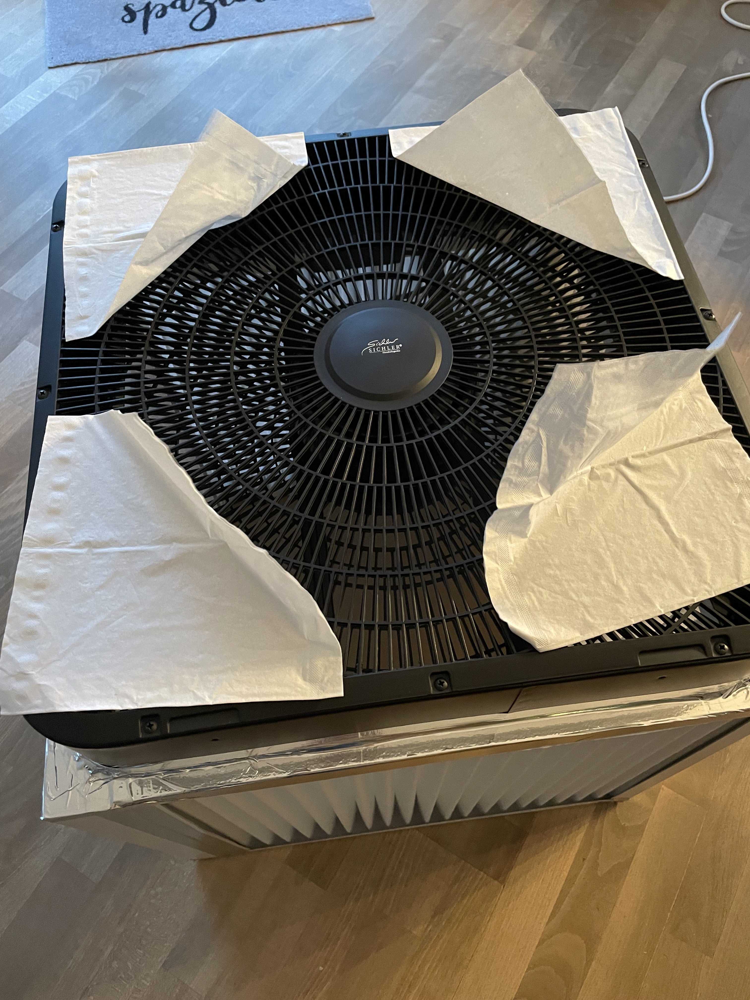

Measured from the center, the airflow happens in a circle of about 18 cm in diameter. Cut out a fan shroud of the appropriate size and place it on the fan. Seal it with adhesive tape.
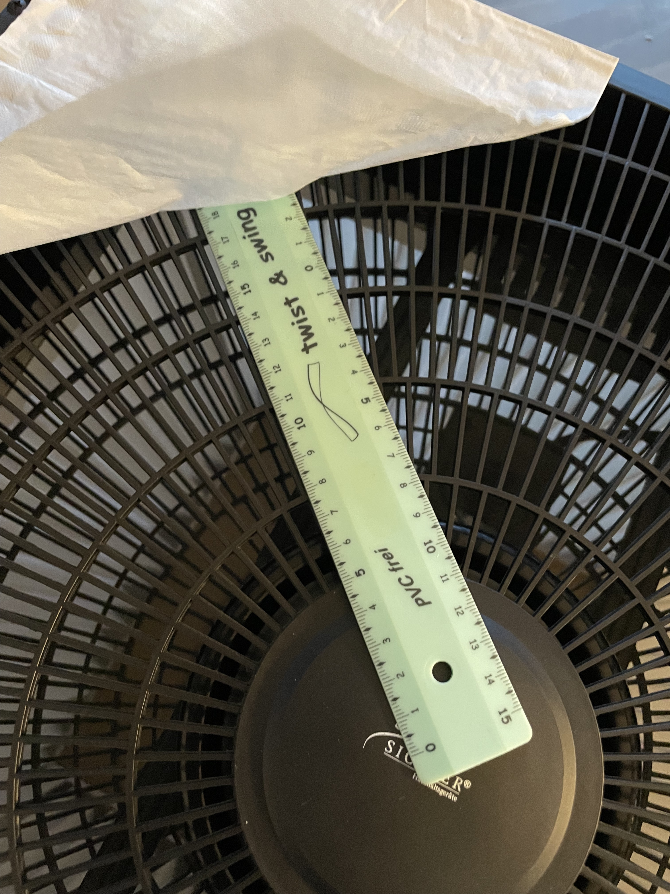

## Noise

At its highest setting, at about 1m distance I measure about 56 dB using the most sophisticated measurement device I have available.
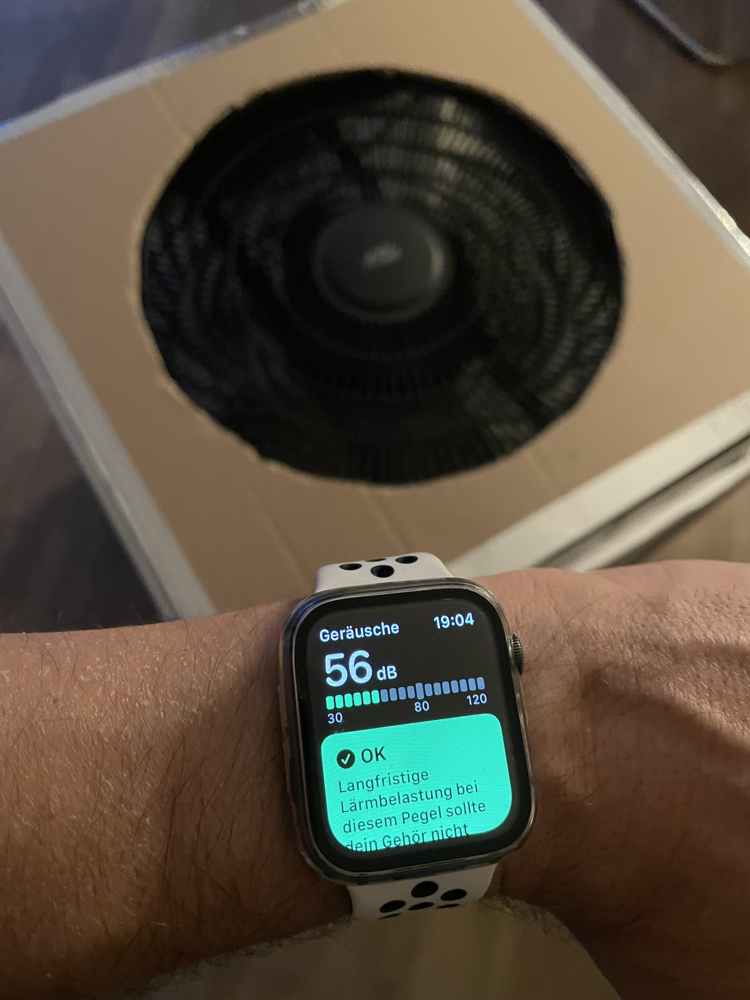

At the medium setting, I measure about 49 dB in 1m distance and 47 dB at 2m distance.
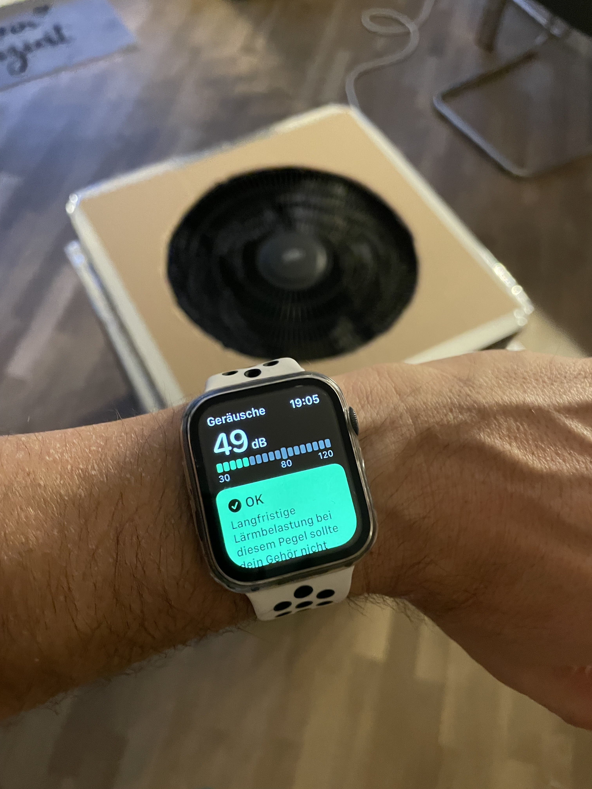
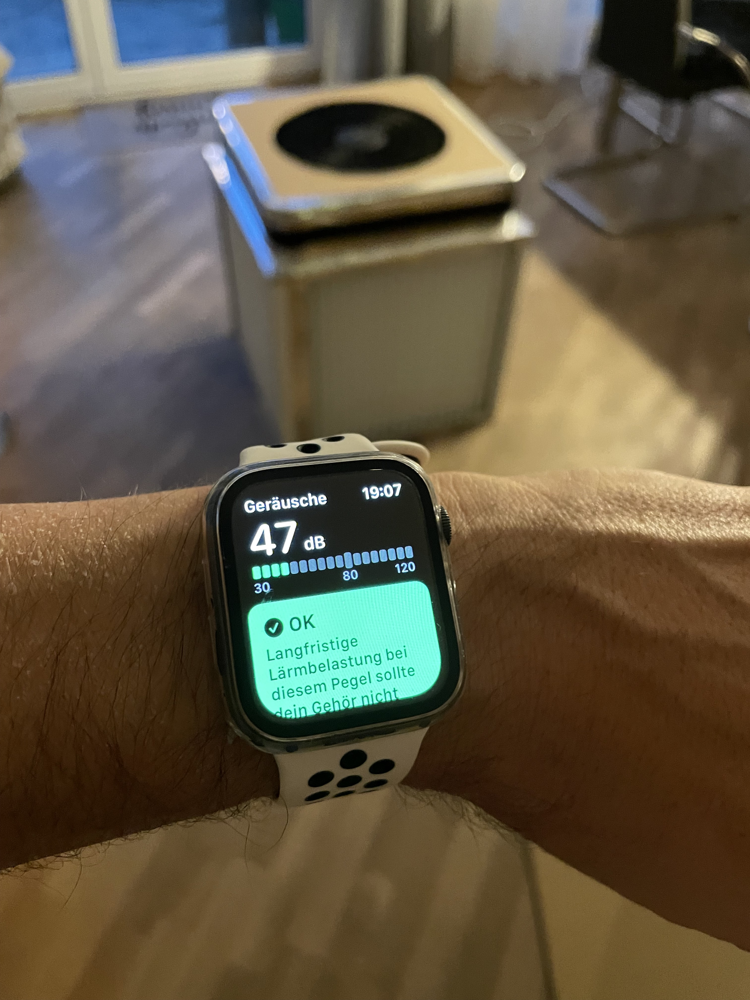

## Effectiveness

I don't have access to any measurement device to measure the airflow to calculate CADR.

Shield: [![CC BY-SA 4.0][cc-by-sa-shield]][cc-by-sa]

This work is licensed under a
[Creative Commons Attribution-ShareAlike 4.0 International License][cc-by-sa].

[![CC BY-SA 4.0][cc-by-sa-image]][cc-by-sa]

[cc-by-sa]: http://creativecommons.org/licenses/by-sa/4.0/
[cc-by-sa-image]: https://licensebuttons.net/l/by-sa/4.0/88x31.png
[cc-by-sa-shield]: https://img.shields.io/badge/License-CC%20BY--SA%204.0-lightgrey.svg

